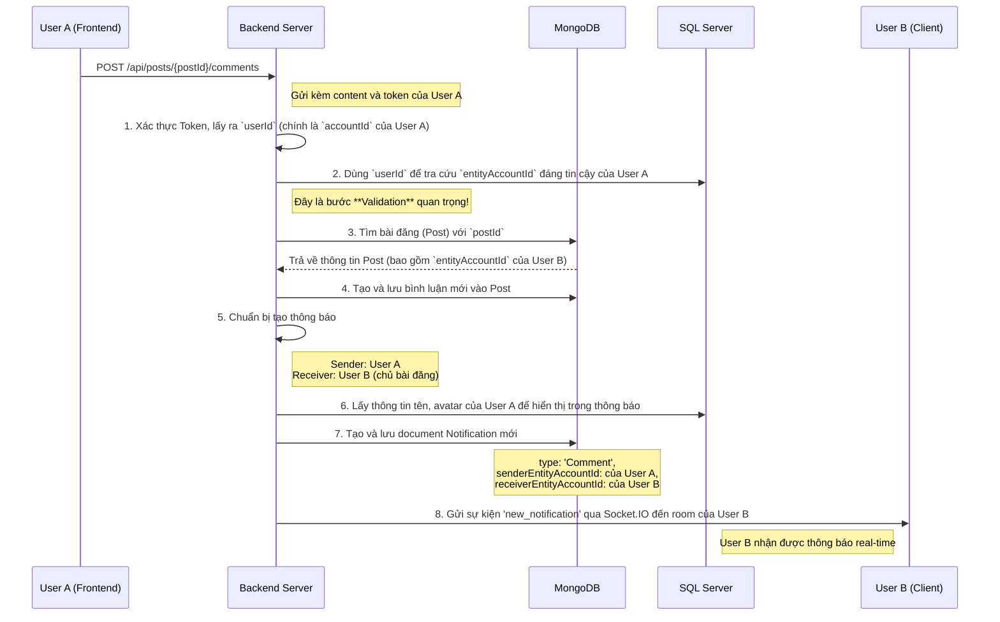
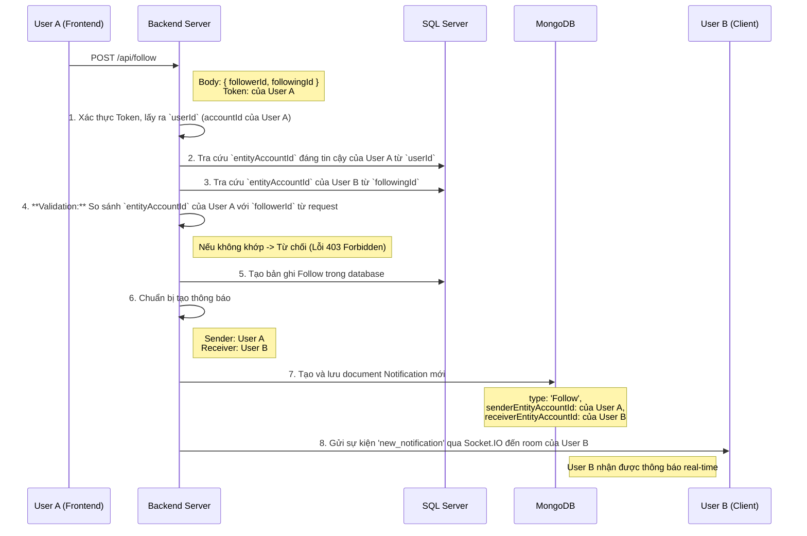

# Tài Liệu Luồng Thông Báo (Notification Flow)

## 1. Tổng Quan

Tài liệu này giải thích chi tiết luồng hoạt động của hệ thống thông báo trong ứng dụng, tập trung vào hai tính năng chính: **Bình luận (Comment)** và **Theo dõi (Follow)**. Mục tiêu là cung cấp một cái nhìn rõ ràng, dễ hiểu về cách một thông báo được tạo ra, xử lý và gửi đến người dùng cuối.

### Luồng Hoạt Động Cơ Bản

```
Người dùng A (Sender)      Hành Động (Comment/Follow)      Người dùng B (Receiver)
       │                           │                           │
       └─────────> Backend Server ───────────> Tạo Notification ───> Gửi đến User B qua Socket.IO
```

---

## 2. Các Khái Niệm Chính

Để hiểu rõ luồng hoạt động, cần phân biệt rõ hai khái niệm sau:

*   **`accountId`**: Đây là ID định danh **duy nhất** của một tài khoản người dùng trong hệ thống (lưu trong bảng `Accounts` của SQL Server). Nó được chứa trong **JWT Token** sau khi người dùng đăng nhập và được xem là **Nguồn Gốc Của Sự Thật (Source of Truth)** để xác định danh tính người dùng đang thực hiện request.

*   **`entityAccountId`**: Đây là ID đại diện cho một "thực thể" có thể hành động trong hệ thống (người dùng cá nhân, trang của Bar, DJ, Dancer). Mỗi `accountId` sẽ tương ứng với một hoặc nhiều `entityAccountId`. **Mọi hành động (post, comment, follow) đều được ghi nhận thông qua `entityAccountId`**.

**Tại sao lại phức tạp như vậy?** Vì một người dùng (`accountId`) có thể quản lý nhiều trang (`entityAccountId`), ví dụ như tài khoản cá nhân và trang của một quán Bar.

---

## 3. Luồng Hoạt Động Chi Tiết

### 3.1. Luồng Thông Báo Khi Có Bình Luận Mới

**Kịch bản:** User A bình luận vào bài đăng (Post) của User B.



**Giải thích các bước quan trọng:**

*   **Bước 2 (Validation):** Đây là bước bảo mật cốt lõi đã được thêm vào. Server **không tin tưởng** `entityAccountId` gửi từ frontend. Thay vào đó, nó dùng `accountId` từ token (không thể giả mạo) để tra cứu ra `entityAccountId` chính xác. Điều này ngăn chặn User A giả mạo User C để bình luận.
*   **Bước 3 & 5 (Fallback):** Nếu bài đăng của User B là một bài đăng cũ và không có `entityAccountId`, hệ thống sẽ dùng `accountId` của User B (lưu trong post) để tra cứu ra `entityAccountId`. Điều này đảm bảo thông báo vẫn được gửi đúng người.

### 3.2. Luồng Thông Báo Khi Có Lượt Theo Dõi Mới

**Kịch bản:** User A theo dõi (follow) User B.



**Giải thích bước quan trọng:**

*   **Bước 4 (Validation):** Tương tự như luồng bình luận, đây là bước kiểm tra bảo mật. Nó đảm bảo rằng User A chỉ có thể thực hiện hành động follow cho chính mình, không thể thay mặt người khác.

---

## 4. Các Cải Thiện Đã Thực Hiện

Luồng thông báo đã được nâng cấp với 3 mục tiêu chính:

1.  **✅ Tăng Độ Tin Cậy (Reliability):**
    *   **Vấn đề:** Các bài đăng cũ không có `entityAccountId` khiến việc gửi thông báo thất bại.
    *   **Giải pháp:** Thêm logic **Fallback**. Nếu `entityAccountId` không tồn tại, hệ thống sẽ tự động dùng `accountId` để tra cứu, đảm bảo thông báo luôn được gửi đi.

2.  **✅ Tăng Cường Bảo Mật (Security):**
    *   **Vấn đề:** Backend đã tin tưởng dữ liệu (`entityAccountId`, `followerId`) gửi từ frontend, tạo ra lỗ hổng giả mạo danh tính.
    *   **Giải pháp:** Thêm logic **Validation**. Hệ thống luôn dựa vào `accountId` từ token để xác định danh tính thật của người dùng và kiểm tra chéo với dữ liệu từ frontend.

3.  **✅ Cải Thiện Khả Năng Gỡ Lỗi (Debuggability):**
    *   **Vấn đề:** Log cũ không đủ chi tiết.
    *   **Giải pháp:** Thêm các log chi tiết vào các bước quan trọng (tạo thông báo, gửi socket) để dễ dàng theo dõi và chẩn đoán sự cố khi cần.

---

## 5. Tóm Tắt

Luồng thông báo hiện tại đã được thiết kế lại để trở nên **An toàn**, **Đáng tin cậy** và **Dễ bảo trì** hơn. Bằng cách kết hợp giữa Validation và Fallback, hệ thống không chỉ bảo vệ người dùng khỏi các hành vi giả mạo mà còn đảm bảo hoạt động ổn định với các dữ liệu cũ.
